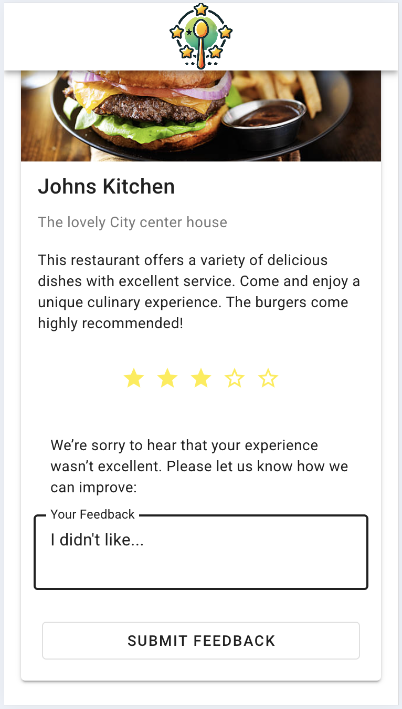
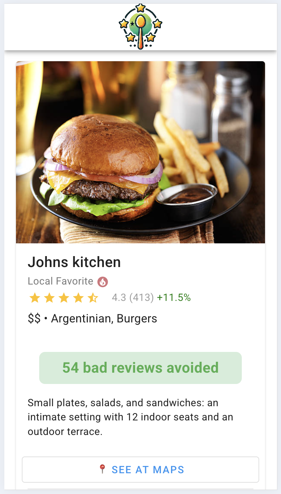
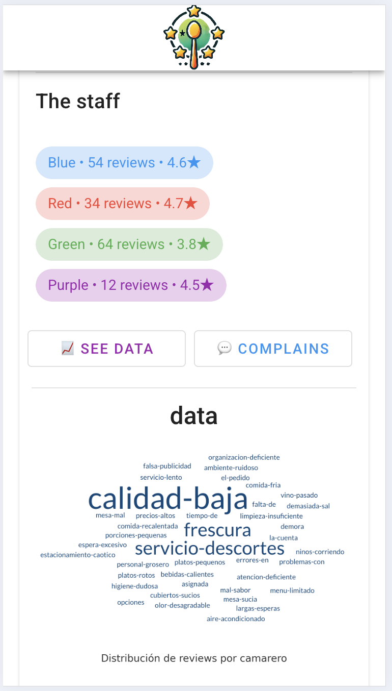
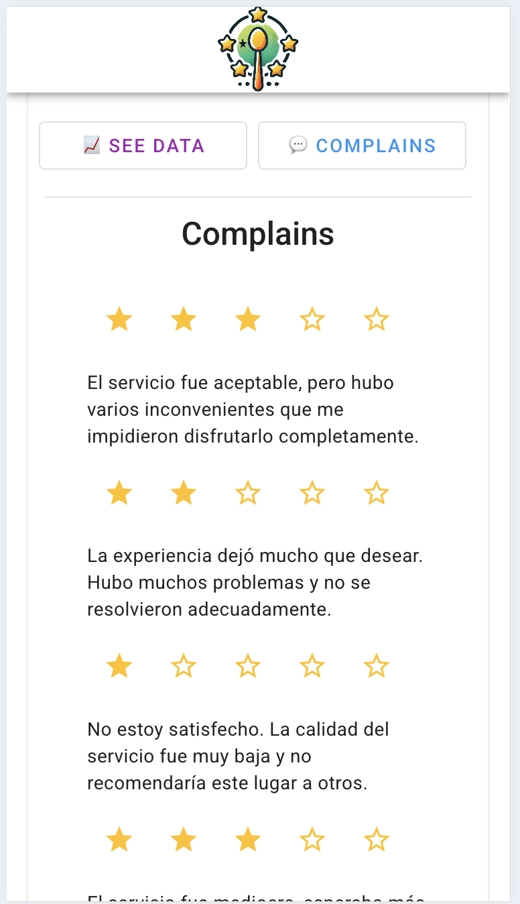
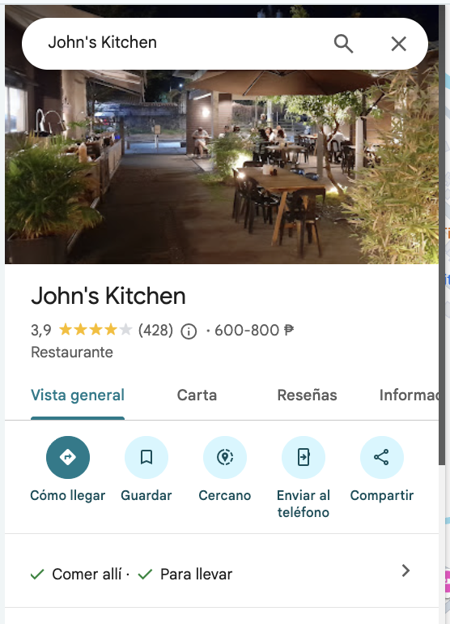

# Rate Your Table

## Turn customer feedback into insights and better reviews!

Rate Your Table helps restaurants turn positive customer experiences into Google Maps reviews and keeps negative feedback private—directly in the hands of managers.

## Pain Points We Solve:

- ❌ Negative reviews harming your online reputation
- 🌟 Need for more positive reviews
- 📊 Managers needing actionable feedback

Attracting new customers & increase restaurant visibility while giving managers real-time insights to improve service quality and customer satisfaction.

<table style="width: 100%; border: 1px solid #fefefe; border-collapse: collapse; border-radius: 8px; overflow: hidden;">
  <tr>
    <td style="vertical-align: top; border: 1px solid #fefefe; padding: 10px; width: 73%;">
      <strong>How it works:</strong>  
      1. Scan a QR code on the bill. 
      2. Positive rating (4–5 ⭐) → redirect to Google Maps. 
      3. Negative rating (1–3 ⭐) → feedback goes straight to managers.
    </td>
    <td style="vertical-align: top; border: 1px solid #fefefe; padding: 10px; width: 30%;">
      
    </td>
  </tr>
</table>

<table style="width: 100%; border: 1px solid #fefefe; border-collapse: collapse; border-radius: 8px; overflow: hidden;">
  <tr>
    <td style="vertical-align: top; border: 1px solid #fefefe; padding: 10px; width: 73%;">
      <strong>Manager Backoffice:</strong>  
      - Track avoided negative reviews 
      - Monitor rating improvements on Google Maps 
      - Analyze detailed stats, feedback, and staff performance
    </td>
    <td style="vertical-align: top; border: 1px solid #fefefe; padding: 10px; width: 30%;">
      
    </td>
  </tr>
</table>

<table style="border: 1px solid #fefefe; border-collapse: collapse; border-radius: 8px; overflow: hidden;">
  <tr>
    <td style="vertical-align: top; border: 1px solid #fefefe; text-align: center; width: 25.0%; padding: 10px;">
        
      📊 Performance metrics
    </td>
    <td style="vertical-align: top; border: 1px solid #fefefe; text-align: center; width: 25.0%; padding: 10px;">
        
      🗯️⁉️ Private feedback
    </td>
    <td style="vertical-align: top; border: 1px solid #fefefe; text-align: center; width: 33.33%; padding: 10px;">
        
      🗺️ Google Maps reviews
    </td>
  </tr>
</table>
